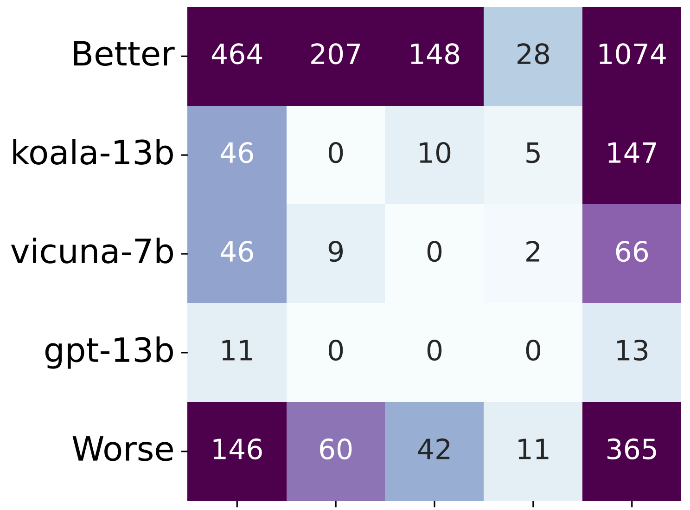

# am-ELO: A Stable Framework for Arena-based LLM Evaluation

This document serves as the code specification for the paper *"am-ELO: A Stable Framework for Arena-based LLM Evaluation"*(), which has been accepted by **ICML 2025** and will be presented as a **Spotlight** paper at the conference.

## Requirements

Our work can **run in a normal environment (including pandas, numpy, and torch)**.  You can also reconfigure the environment by following steps:

First create a Python environment python:

```setup
conda create --name ELO python=3.11.5
```

To install requirements:

```setup
pip install -r requirements.txt -f https://download.pytorch.org/whl/torch_stable.html
```

## Structure

Here is the contents for the Code:

```train
am-ELO/
│
├── data/
│   ├── Chatbot.csv
│
├── dataset.py
│
└── model.py
│
└── setting.py
│
└── utils.py
|
└── main.py
```

**Chatbot.csv**  is the dataset download from huggingface.

**dataset.py** is the code for processing real data and simulating data

**model.py** is the code of estimation models (**Traditional ELO**, **m-ELO** and **am-ELO**)

## Data Downloading and Preprocessing

**！！！The data is provided, which means you can skip this step.**

To get the dataset used in experiments, you can see the details for Chatbot Dataset on huggingface ([lmsys/chatbot_arena_conversations · Datasets at Hugging Face](https://huggingface.co/datasets/lmsys/chatbot_arena_conversations)).

During code execution, annotators with less than **50** annotation records will be filtered out. Here is the statistical information of the filtered dataset.

| Dataset                       | Chatbot |
| ----------------------------- | ------- |
| #Annotators                   | 42      |
| #Models                       | 20      |
| #Response logs                | 4,321   |
| #Response logs per annotater  | 102.88  |
| #Response logs per model      | 216.05  |
| #Response logs per model pair | 22.74   |

## Run

To run my model, please use the following instruction:

```train
python main.py --method=m-ELO --data_path=data/chatbot.csv --seed=2025 --device=cuda
```

>**method** can choose the estimation for ELO scores, including random, **ELO**, **m-ELO**, **am-ELO**
>
>**data_path** is the dataset used in the experiment, including **data/Chatbot.csv**.
>
>**seed** controls the initialization parameters, and the seed used in the article is **2023**, **2024**, **2025**, **2026**, **2027**.

## Result

The performance of ELO method for prediction (**Table 2**)

| Method | MSE                | AUC                |
| ------ | ------------------ | ------------------ |
| ELO    | 0.1238± 0.0031     | 0.7492± 0.0068     |
| m-ELO  | 0.1234± 0.0029     | 0.7503± 0.0066     |
| am-ELO | **0.1208**± 0.0034 | **0.7581**± 0.0067 |

The ELO Scores and the loss of  ELO method (**Figure 3**):


The heatmap of the case study (**Figure 4**):



 The loss and consistency of the ELO method (**Figure 5**):


The Simulation experiment (**Figure 6,7**):


## Contributing

>📋  We use the MIT License.
